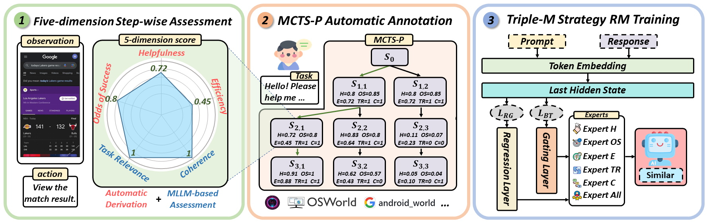

<h1 align="center" style="line-height: 40px;">
  Boosting Virtual Agent Learning and Reasoning: A Step-wise, Multi-dimensional, and Generalist Reward Model with Benchmark
</h1>


## 📖 Introduction
Welcome to the official repository for the paper "Boosting Virtual Agent Learning and Reasoning: A Step-wise, Multi-dimensional, and Generalist Reward Model with Benchmark". In this work, we propose **Similar**, a **S**tep-w**i**se **M**ult**i**-dimensiona**l** Gener**a**list **R**eward Model designed to enhance the training and reasoning capabilities of Generalist Virtual Agents (GVAs) powered by Multimodal Large Language Models (MLLMs). This project addresses critical limitations in current GVA training paradigms, such as the reliance on outcome supervision and labor-intensive human annotations, by introducing a novel approach to fine-grained, step-wise supervision. We are excited to open-source our **Similar** reward model and the ***SRMEval*** test dataset, providing the research community with valuable resources to advance the development of virtual agents.



## 🔥 News
- We will release the paper, dataset, and code soon.


## 📝 TODO
- [ ] Release ***SRMEval*** Benchmark. 
- [ ] Release data collection pipelines of ***SRM***.
- [ ] Release checkpoints of **Similar**.
- [ ] Release inference code.
- [ ] Release training scripts.


## 💡 Overview

GVAs are designed to process multimodal inputs (e.g., UI elements, text, visuals) and navigate digital environments to perform tasks. However, traditional training methods rely heavily on outcome-based rewards, which lack the granularity needed to guide agents effectively through complex tasks. To overcome these challenges, we propose **Similar**, a reward model that provides multi-dimensional, step-wise supervision signals to guide agent learning and reasoning.


### Applications


**Similar** enhances GVA performance in two key phases:

- **Training Phase**: As a reward model in reinforcement learning frameworks, **Similar** provides fine-grained feedback to optimize agent behavior, improving task performance.
- **Inference Phase**: Integrated with search algorithms like MCTS, **Similar** enhances reasoning efficiency, ensuring that actions lead to successful task completion.

### Contributions

- **Five Key Dimensions**: We define five dimensions for step-wise GVA assessment and introduce an automated framework using MCTS-P to collect fine-grained, cross-platform reward model data annotations.
- **Triple-M Strategy**: We propose a Triple-M strategy to train **Similar**, integrating multiple dimensions and generating synergistic gains for robust, fine-grained feedback.
- **SRM Benchmark**: We introduce ***SRMEval***, a multi-step, multi-dimensional benchmark for evaluating reward models, advancing research in reward model performance assessment.
- **Superior Performance**: Our approach achieves superior GVA performance across diverse tasks and environments, demonstrating the effectiveness of step-wise multi-dimensional assessment and synergistic expert integration.

We are pleased to open-source our **Similar** reward model and the ***SRMEval*** test dataset, providing the community with tools to further advance the field of Generalist Virtual Agents. For more details, please refer to our paper and the accompanying documentation.

## 🛠️ Setups for SRMEval

Since reward models are crucial for enhancing GVAs' performance, and prior research has not focused on evaluating specific reward models, we propose **SRM**, the first benchmark in the virtual agent domain for step-wise, multi-dimensional reward model training and evaluation.

we proposed a new task for reward models in the virtual agent domain: *Selecting the better action (i.e., the chosen action) from two actions at step i for a given instruction task*. The evaluation metric is Accuracy, measuring the reward model's ability to select the better action. Accuracy is calculated under a specific evaluation type.

Here are some cases of *SRMEval*.


## 🛠️ Setups for Similar


## 📜 Citation
If you find this work useful for your research, please cite our paper and star our git repo:
```bibtex

```


